# TapirXL — Architecture

| Field    | Value                                               |
| -------- | --------------------------------------------------- |
| Document | Deterministic Passive Medical-Device Identification |
| Version  | 4.1                                                 |
| Date     | 2026-05-19                                          |
| Status   | Authoritative for `main`                            |

---

## §1 — Purpose and Domain

Given a PCAP file, produce a deterministic per-host inventory of medical and
medical-adjacent devices observable on the wire, with no active probing and no
LM inference. The output is consumed by humans (piped through `jq`), other
tooling (CSV pipelines, SIEM ingest), and downstream asset-management services
over the `HostEnvelope` JSONL wire contract.

The core domain is the **deterministic transformation of captured network
packets into a per-host inventory of medical-adjacent devices**, subject to
four irreducible constraints:

1. **Read-only.** No packets emitted, no DNS queries against observed names, no
   sockets opened by any extractor. Static-file reads only.
2. **Offline first.** PCAP files are the primary input. Streaming sources are
   adapters over the same domain model.
3. **Deterministic.** Identical input PCAPs produce bit-identical JSONL output
   across every commit.
4. **PHI-safe.** DICOM `(0010,*)` tags and HL7 PID-3/5/7/8 fields are redacted
   before any record leaves an extractor.

What makes this a coherent domain — not just "a parser" — is the
classification work that operates only on what packets reveal: vendor arcs,
service-type codes, fingerprint shape, contradiction patterns. The
parser-as-aggregator is the differentiating asset.

### 1.1 Scope

| Category  | In scope                                                                  | Out of scope                                     |
| --------- | ------------------------------------------------------------------------- | ------------------------------------------------ |
| Input     | PCAP file path; live interface via `tapirxl listen --interface IFACE` | Active probing, DNS resolution of observed names |
| Output    | `HostEnvelope` JSONL, `InventoryRecord` JSONL                             | Markdown reports (agent tier), parser-side REST  |
| Inference | Rule-based labelers, consensus, floor triggers, contradiction codes       | LM normalization, fusion, ReAct (agent tier)     |
| Storage   | None in the parser (stdin/stdout pipes)                                   | Persistent asset records, drift events           |
| Network   | Vector shipper → BlueFlow upsert (separate process; parser stays offline) | Active probing, DNS resolution of observed names |

### 1.2 Bounded contexts

Three bounded contexts share one stable wire contract:

| Context            | Location                    | Responsibility                                                             |
| ------------------ | --------------------------- | -------------------------------------------------------------------------- |
| **TapirXL Stable** | this repo, `main`           | PCAP → `HostEnvelope` / `InventoryRecord`; Vector translation and delivery |
| **TapirXL Agent**  | `experimental/agent` branch | LM normalize, fusion, markdown reports — not part of `main`                |
| **BlueFlow**       | external repo               | Asset store; consumes translated payloads at `/api/assets/upsert/`         |

`HostEnvelope` JSONL is the cross-context wire contract between parser and any
downstream consumer. `InventoryRecord` JSONL is the public projection
(`tapirxl parse --json`). Field changes require a coordinated version bump
(`schema_version` on `HostEnvelope`; semver on the package for `InventoryRecord`).

---

## §2 — Ubiquitous Language

The following terms have one and only one meaning across the codebase.

| Term                    | Meaning                                                                                                                                                |
| ----------------------- | ------------------------------------------------------------------------------------------------------------------------------------------------------ |
| **Host**                | A MAC address observed in the capture. Identity equals MAC (`host_id`); IP is observational, not identifying.                                          |
| **Signal**              | One protocol-level observation about a host (DICOM A-ASSOC, WS-D Hello, DHCP Discover, etc.).                                                          |
| **HostEnvelope**        | The aggregate root: every signal observed for one MAC, plus deterministic labels, triage routing, and ambiguity metadata. Wire contract for consumers. |
| **Pipeline**            | One of three concurrent extraction families (broadcast / session / DPI). Pipelines are bands of signal types, not threads.                             |
| **Deterministic label** | A label assigned by per-pipeline rule (no LM), with a `HIGH` / `MEDIUM` / `LOW` confidence.                                                            |
| **Consensus**           | Cross-pipeline aggregate of deterministic labels with a single confidence value.                                                                       |
| **Floor trigger**       | A categorical signal that forces a host out of `STAMP_LOW` even at `signal_count == 1` (e.g. `MEDICAL_UUID_PREFIX`, `HL7_CLINICAL_INTERFACE`).         |
| **Contradiction**       | A coded conflict between two signals (`C1`..`C4`). Routing-significant but never auto-fails a host.                                                    |
| **Ambiguity**           | A field value not deterministically matchable to a known label. Stored verbatim in `lm_envelope.ambiguous_fields[]` for downstream consumption.        |
| **Routing**             | The triage decision for a host, drawn from a closed enum (see §6).                                                                                     |
| **InventoryRecord**     | The public projection of one host's envelope to the wire format defined in `schemas/inventory_record.schema.json`.                                     |
| **OUI**                 | The 24-bit Layer-2 vendor prefix lookup. A supporting subdomain.                                                                                       |

---

## §3 — Subdomain Map

Subdomains follow Evans' three categories: **Core** (the differentiating
asset), **Supporting** (custom work serving the core), **Generic** (commodity
plumbing).

| #    | Subdomain                 | Classification | Lives in                                                                    | Responsibility                                                               |
| ---- | ------------------------- | -------------- | --------------------------------------------------------------------------- | ---------------------------------------------------------------------------- |
| 3.1  | Signal Extraction         | Supporting     | `src/tapirxl/parser/extractors/`                                            | Protocol-specific reads → per-packet signal records. PHI redacted at source. |
| 3.2  | Host Envelope Aggregation | **Core**       | `src/tapirxl/parser/envelope_builder.py`                                    | Merge signals into per-MAC `HostEnvelope`. Aggregate root invariants.        |
| 3.3  | Deterministic Labeling    | **Core**       | `src/tapirxl/parser/deterministic.py`                                       | Per-pipeline labelers + cross-pipeline consensus.                            |
| 3.4  | Triage / Routing          | **Core**       | `src/tapirxl/parser/triage.py`                                              | Cross-pipeline contradiction scan + routing decision.                        |
| 3.5  | Inventory Projection      | **Core**       | `src/tapirxl/core/inventory_record.py` + `src/tapirxl/schemas/inventory.py` | `HostEnvelope` → `InventoryRecord`. CPE slugs, device class, open ports.     |
| 3.6  | Wire Projection           | **Core**       | `src/tapirxl/parser/serialize.py` + `src/tapirxl/schemas/envelope.py`       | Flat runtime dict → typed `HostEnvelope`. Single seam.                       |
| 3.7  | Static Reference Data     | Supporting     | `src/tapirxl/parser/tables.py` + `static/*.json` + `static/ieee_oui.txt`    | OUI lookup, DICOM impl-UID arcs, Fingerbank DHCP, HL7 sending apps, SNMP.    |
| 3.8  | Fixture Generation        | Supporting     | `src/tapirxl/fixtures/`                                                     | Synthetic Philips demo PCAP for regression and demos.                        |
| 3.9  | Ports & Adapters          | Generic        | `src/tapirxl/parser/ports.py` + `src/tapirxl/parser/adapters/`              | `PacketSource`, `EnvelopeSink` Protocols; pyshark + stdout adapters.         |
| 3.10 | CLI                       | Generic        | `src/tapirxl/cli.py` + `src/tapirxl/parser/cli.py`                          | Typer entry points. Thin wrappers, no domain logic.                          |

---

## §4 — Toolchain

| Tool        | Role                                                                                   |
| ----------- | -------------------------------------------------------------------------------------- |
| Python 3.14 | Runtime                                                                                |
| uv          | Resolver + venv + lockfile                                                             |
| ruff        | Linter + formatter                                                                     |
| just        | Task runner                                                                            |
| pytest      | Test runner                                                                            |
| mypy        | Type checker (dev)                                                                     |
| pyshark     | PCAP dissection (depends on `tshark` PATH)                                             |
| pydantic v2 | Wire-contract models                                                                   |
| typer       | CLI                                                                                    |
| Vector      | Log shipper to BlueFlow (see §12). Binary pin in `packaging/docker/vector/Dockerfile`. |

`pyproject.toml` is the single source of project metadata. Recipes live in
[`justfile`](../justfile). Vector operator recipes: `vector-validate`, `vector-test`,
`upload-dry-run`, `docker-build`, `compose-config`, `docker-dry-run`.

---

## §5 — Package Layout

```
src/tapirxl/
├── core/                  # MAC, OUI, PHI, CPE enums, IP sort — no project imports
│   ├── enums.py
│   ├── inventory_record.py     # HostEnvelope → InventoryRecord projection
│   ├── ip.py
│   ├── mac.py
│   ├── oui.py
│   ├── phi.py
│   └── ws_tables.py
├── parser/                # Deterministic only — no LM imports
│   ├── adapters/
│   │   ├── pyshark_source.py
│   │   └── stdout_sink.py
│   ├── extractors/        # One file per protocol
│   ├── _helpers.py
│   ├── cli.py             # `tapirxl-parse` entry
│   ├── deterministic.py   # Per-pipeline labelers + consensus
│   ├── envelope_builder.py
│   ├── pipeline.py
│   ├── ports.py           # PacketSource, EnvelopeSink Protocols
│   ├── serialize.py       # Flat dict → typed HostEnvelope projection
│   ├── tables.py
│   └── triage.py
├── schemas/               # Pydantic v2 wire contracts
│   ├── envelope.py        # HostEnvelope (typed wire format)
│   └── inventory.py       # InventoryRecord (public CLI projection)
├── fixtures/              # Synthetic PCAP generator
└── cli.py                 # Typer app — parse + fixtures

configs/                   # Vector shipper (not Python; see §12)
├── upload-vector.toml        # compose long-running (file source -> http)
├── upload-vector.stdin.toml  # demo stdin pipeline (pcap + live → http)
├── upload-vector.dryrun.toml # dev (stdin -> console)
├── upload-vector.vrl         # shared translation
├── upload-vector.tests.toml
└── upload.env.example

packaging/docker/          # Parser + shipper images, compose fragment
```

`schemas/inventory_record.schema.json` at the repository root is the JSON
Schema mirror of [`schemas/inventory.py`](../src/tapirxl/schemas/inventory.py).
Static reference data (`ieee_oui.txt`, `fingerbank_dhcp_55.json`,
`dicom_impl_uid_arcs.json`, `hl7_sending_apps.json`,
`snmp_sysobjectid_arcs.json`) lives under `static/`.

---

## §6 — Three Pipelines

Each pipeline is a band of protocol signal types, not a thread. All three feed
the same per-MAC `HostEnvelope`.

| #   | Name                  | Protocols                                                                                           | Latency       |
| --- | --------------------- | --------------------------------------------------------------------------------------------------- | ------------- |
| 1   | Broadcast / multicast | WS-Discovery, mDNS, DNS-SD, LLMNR, SSDP, ARP, Capsule MDIP                                          | < 60 s        |
| 2   | Session / passive OS  | TCP SYN fingerprint, TLS Hello (SNI), SMB2 Negotiate, NTLMSSP, Kerberos, DNS, SSH                   | first connect |
| 3   | Event-driven DPI      | DICOM A-ASSOC, DHCP (option 12/55/60 + Fingerbank), HL7 MLLP (PHI-scrubbed), SNMP (sysDescr/sysOID) | event-bound   |

Block presence in the envelope **is** the signal; missing blocks are absent
(`None`), never empty objects.

The single-pass pyshark sweep that drives extraction lives in
[`parser/pipeline.py`](../src/tapirxl/parser/pipeline.py). Per-protocol
extraction lives in [`parser/extractors/`](../src/tapirxl/parser/extractors/).

### 6.1 Identification sequence (end-to-end)

The diagram below traces one PCAP through the deterministic identification
chain that `tapirxl parse` actually runs today. Every step is read-only: no
sockets are opened, no observed hostnames are resolved, and PHI is redacted at
the extractor boundary (A3, A4). Each lane corresponds to one module under
[`src/tapirxl/parser/`](../src/tapirxl/parser/) plus the
[`core/inventory_record.py`](../src/tapirxl/core/inventory_record.py) projection.

```mermaid
sequenceDiagram
    participant PCAP as PCAP file
    participant Pipe as parser/pipeline.py<br/>single-pass pyshark sweep
    participant Ext as parser/extractors/*<br/>read-only, PHI-redacted at source
    participant Env as parser/envelope_builder.py<br/>per-MAC aggregate
    participant Det as parser/deterministic.py<br/>per-pipeline labelers + consensus
    participant Tri as parser/triage.py<br/>contradictions + routing
    participant Out as parser/serialize.py + core/inventory_record.py<br/>stdout JSONL

    Note over PCAP,Pipe: 1. Open the capture (offline FileCapture or live LiveCapture on iface)
    alt offline PCAP
        PCAP->>Pipe: pyshark.FileCapture(DISPLAY_FILTER)
    else live interface
        PCAP->>Pipe: pyshark.LiveCapture(iface, DISPLAY_FILTER)
    end
    loop For each packet
        Pipe->>Ext: dispatch by L4 port / dissector presence

        Note right of Ext: One file per protocol&#59; each returns a flat record<br/>{protocol, src_mac, src_ip, raw_fields, timestamp}

        alt WS-Discovery (UDP/3702)
            Ext->>Ext: extract UUID from XML/payload&#59;<br/>vendor_prefix = UUID[0:4] hex<br/>(5048 PH, 4745 GE, 5349 SI, 4452 DR, 4243 BC)&#59;<br/>series_code = ascii(UUID[4:8]) → BH / BV / GD …
            Ext-->>Pipe: WS_DISCOVERY: {ws_uuid, ws_vendor_prefix, ws_series_code, ws_types, ws_scopes}
        else mDNS / DNS-SD / LLMNR (UDP/5353, 5355)
            Ext->>Ext: A-record hostnames, TXT key=value,<br/>PTR service names, LLMNR self-claims
            Ext-->>Pipe: MDNS_A / MDNS_TXT / DNS_SD_PTR / LLMNR records
        else DICOM (TCP/104, 2104, 2762)
            Ext->>Ext: slice Eth+IP+TCP payload via dissector header lengths&#59;<br/>read PDU type byte&#59;<br/>User-Info: 0x52 → implementation_class_uid,<br/>0x55 → implementation_version_name&#59;<br/>scan PDU for vendor arcs (1.3.46.*, 1.2.840.113704.*)&#59;<br/>explicit-VR-LE walk: (0008,0060) modality,<br/>(0008,0070) manufacturer, (0008,1090) model,<br/>(0018,1020) sw_versions&#59;<br/>(0010,*) PHI tags redacted at extract
            Ext-->>Pipe: DICOM record (with dicom_association sub-dict)
        else HL7 MLLP (TCP, framed by 0x0B / 0x1C 0x0D)
            Ext->>Ext: require 0x0B head&#59; strip 0x1C 0x0D tail&#59;<br/>parse MSH-3/4/5/9/12&#59;<br/>PID-3/5/7/8 → "&#60;PHI&#62;" before emit
            Ext-->>Pipe: HL7_MLLP record
        else DHCP (options 12, 55, 60)
            Ext->>Ext: option-12 hostname&#59; option-60 VCI&#59;<br/>Fingerbank lookup on option-55 + OUI
            Ext-->>Pipe: DHCP record
        else TCP SYN / TLS SNI / SMB2 NTLMSSP / Kerberos / SSH / SNMP / ARP / SSDP / Capsule MDIP
            Ext-->>Pipe: per-protocol record (see parser/extractors/*.py)
        end
    end

    Note over Pipe,Env: 2. Group records by MAC (host_id is the primary key — A1, A8)
    Pipe->>Env: build_signal_register(records, oui_table)
    Env->>Env: bucket by normalize_mac(src_mac)&#59;<br/>per host_id, make_empty_envelope() + OUI lookup&#59;<br/>for each record (sorted by timestamp)<br/>merge_record_into_envelope() routes raw_fields into:<br/>pipeline_1 (WS-D, mDNS, DNS-SD, LLMNR, SSDP, ARP, Capsule),<br/>pipeline_2 (TCP SYN, TLS SNI, SMB2, NTLMSSP, Kerberos, DNS, SSH),<br/>pipeline_3 (DICOM, DHCP, HL7, SNMP)

    Env->>Env: finalize_envelope_from_records():<br/>- ws_series_code → ws_series_family<br/>  (PHILIPS_INTELLIVUE_SERIES[BH] = MX700/800, BV = MX400/450, GD = X3/X2)<br/>- signal_count from bucket presence<br/>- floor_triggers: MEDICAL_UUID_PREFIX, CLINICAL_SERVICE, EXPERT_ANOMALY,<br/>  DICOM_VENDOR_ARC, DICOM_PHILIPS_IMAGE_UID, DHCP_MEDICAL_VENDOR_CLASS,<br/>  HL7_CLINICAL_INTERFACE, SNMP_MEDICAL_SYSDESCR, SSDP_MEDIA_CLOUD

    Env-->>Tri: enriched envelope (per host_id)

    Note over Tri,Det: 3. Per-host scan, then per-pipeline labels
    Tri->>Tri: contradiction_scan() → triage.contradiction_codes:<br/>C1 OUI vs DICOM vendor arc mismatch<br/>C2 mDNS Chromecast spoof of Philips WS-D signal<br/>C3 Philips WS-D + non-Philips DICOM arc<br/>C4 mDNS hostname ≠ LLMNR hostname

    Tri->>Det: postprocess_pipeline_labels()
    Det->>Det: label_pipeline_1(): WS series_family HIGH,<br/>Capsule MDIP tokens HIGH, SSDP Sonos HIGH, ARP-only LOW
    Det->>Det: label_pipeline_2(): TCP SYN deterministic label<br/>(TTL / MSS / WScale shape) + last-syn confidence_hint&#59;<br/>TLS SNI ecosystem hints&#59; SSH banner prefix
    Det->>Det: label_pipeline_3(): Philips DICOM arc → HIGH,<br/>HL7 sending-app hint, DHCP fingerbank / medical-vendor hint,<br/>SNMP sysDescr hint
    Det-->>Tri: pipeline_n.deterministic_label + .deterministic_confidence

    Note over Tri: 4. Cross-pipeline consensus + 4-value routing (closed enum — A8)
    Tri->>Tri: _consensus_from_pipelines():<br/>2+ HIGH agree (with _subsumes_label) → HIGH,<br/>1 HIGH + any MEDIUM → MEDIUM-cap,<br/>else best available MEDIUM/LOW
    Tri->>Tri: lm_envelope.ambiguous_fields[] populated from<br/>unknown WS-Types prefixes and non-key=value mDNS TXT entries<br/>(verbatim — for downstream consumers&#59; main never runs an LM)
    Tri->>Tri: route_host() first-match-wins:<br/>1. signal_count==0 ∧ no expert_flags → SKIP<br/>2. contradiction_codes non-empty → AMBIGUOUS<br/>3. signal_count==1 ∧ no floor_triggers → STAMP_LOW<br/>4. consensus HIGH ∧ no ambiguous_fields → DETERMINISTIC_FINAL<br/>5. else → AMBIGUOUS
    Tri-->>Out: routed envelope (per host_id, MAC-sorted)

    Note over Out: 5. Emit on stdout (the data contract — N6, A10, A11)&#59;<br/>progress, pyshark/tshark noise, and summaries go to stderr
    alt tapirxl parse &#60;pcap&#62; (default)
        Out->>Out: serialize.to_envelope(flat) → typed HostEnvelope<br/>(pydantic v2&#59; pipeline_n is None when not fired — A2)
        Out-->>PCAP: HostEnvelope JSONL — one envelope per MAC
    else tapirxl parse &#60;pcap&#62; --json
        Out->>Out: build_jsonl_record() — CPE-aligned projection:<br/>hostname: DHCP opt-12 → LLMNR → NTLMSSP → mDNS<br/>vendor: DICOM (manufacturer / impl_uid arc / image_uid arc)<br/>→ WS-D prefix → DHCP VCI → OUI<br/>product: DICOM model / impl_uid arc → DHCP VCI fingerbank<br/>→ WS-D series_code (BH → intellivue_mx700)<br/>version: DICOM (0018,1020) → mDNS TXT firmware / sw_version<br/>device_class: DICOM Modality (CT/MR/US/CR/DX/MG/NM/PT)<br/>→ WS-D series → DHCP role<br/>→ NTLMSSP/SNI/A-ASSOC-AC heuristic (workstation, server, pacs)<br/>open_ports: 3702 / 5353 / 5355 / 5090 / 1900 + DNS-SD service map<br/>confidence: DETERMINISTIC_FINAL → consensus,<br/>STAMP_LOW or single-signal no-floor → LOW, else → LOW
        Out-->>PCAP: InventoryRecord JSONL — one record per MAC
    end
```



What this diagram makes binding:

- **MAC is the join key.** Extractors emit per-packet records keyed by source
  MAC (with OUI from the static table). Aggregation, labeling, and routing all
  happen per host_id; IP is observational and may appear multiple times in
  `ip_observations[]` (A1).
- **Pipelines are bands, not threads.** A single pyshark sweep dispatches into
  per-protocol extractors. Pipeline membership is decided at envelope-merge
  time by which sub-block the record's `protocol` field maps to.
- **Floor triggers are the bridge between signal_count and confidence.** They
  let a single high-value signal (medical UUID prefix, DICOM vendor arc,
  HL7 MLLP, etc.) escape `STAMP_LOW` even when only one pipeline fired.
- **Contradiction codes never auto-fail a host.** `route_host` early-exits
  populated contradictions to `AMBIGUOUS` so the conflicting signals are
  preserved in the envelope for downstream consumers; `STAMP_LOW` would
  silently lose them.
- **`InventoryRecord` is a projection, not a label.** `vendor`, `product`,
  `device_class`, `version`, and `hostname` are derived from the same
  envelope every consumer can re-derive from. The projection is the only
  place CPE slugs are introduced; the envelope itself stays raw.

---

## §7 — Wire Contracts

Two wire contracts cross the parser boundary.

### 7.1 `HostEnvelope` — Default `tapirxl parse <pcap>` output

Typed model: [`src/tapirxl/schemas/envelope.py`](../src/tapirxl/schemas/envelope.py).

The aggregate root. Top-level fields are closed (`extra="forbid"`); sub-block
models retain `extra="allow"` so extractor-side field drift is tolerated until
those shapes are tightened. Pipeline blocks (`pipeline_1`, `pipeline_2`,
`pipeline_3`) are `None` when the pipeline did not fire.

Projection from the flat runtime envelope produced by
[`envelope_builder.py`](../src/tapirxl/parser/envelope_builder.py) into the
typed shape happens in
[`parser/serialize.py:to_envelope`](../src/tapirxl/parser/serialize.py),
called from [`parser/cli.py`](../src/tapirxl/parser/cli.py) before the JSONL
emit.

Top-level fields:

- `schema_version` (currently `2`; migrations in `schemas/migrations/`)
- `host_id` (MAC, primary key), `oui_vendor`, `ip_observations[]`
- `first_seen`, `last_seen`
- `ethernet`
- `pipeline_1`, `pipeline_2`, `pipeline_3` — `None` when not fired
- `triage` — `signal_count`, `pipelines_fired`, `floor_triggers`,
  `deterministic_consensus`, `contradiction_codes`, `routing`
- `lm_envelope.ambiguous_fields[]` — verbatim ambiguity records for downstream
  consumers

### 7.2 `InventoryRecord` — `tapirxl parse <pcap> --json` output

Pydantic model: [`src/tapirxl/schemas/inventory.py`](../src/tapirxl/schemas/inventory.py).
JSON Schema mirror: [`schemas/inventory_record.schema.json`](../schemas/inventory_record.schema.json).

Nine fields, enum-bounded where enumerable: `hostname`, `ip_address`,
`mac_address`, `vendor`, `product`, `version`, `device_class`, `open_ports`,
`confidence`. Vendor and product slugs align with `cpe:2.3` slots 3 and 4 for
future CVE/CPE binding.

The projection from `HostEnvelope` is implemented in
[`core/inventory_record.py:build_jsonl_record`](../src/tapirxl/core/inventory_record.py).
This is the public demo output and the stable contract for non-TapirXL
consumers; the `--json` flag's semantics do not change without a major
package version bump.

---

## §8 — Triage Routing

`route_host` in [`parser/triage.py`](../src/tapirxl/parser/triage.py) writes
exactly one of four values to `triage.routing`. The enum is closed and
enforced at the schema level via `Literal`:

```
SKIP                 host had no signals worth keeping
STAMP_LOW            one signal, no floor trigger → recorded with LOW confidence
DETERMINISTIC_FINAL  HIGH consensus, no ambiguity, no contradictions
AMBIGUOUS            everything else; downstream consumers may reason further
```

First-match-wins ordering:

1. `signal_count == 0` and no expert flags → `SKIP`
2. Any `contradiction_codes` populated → `AMBIGUOUS` (contradictions are
   preserved; STAMP_LOW would lose them)
3. `signal_count == 1` and no `floor_triggers` → `STAMP_LOW`
4. HIGH consensus, no ambiguous fields → `DETERMINISTIC_FINAL`
5. Everything else → `AMBIGUOUS`

Floor triggers (see [`envelope_builder.finalize_envelope_from_records`](../src/tapirxl/parser/envelope_builder.py))
force a host out of `STAMP_LOW` even at `signal_count == 1`:
`MEDICAL_UUID_PREFIX`, `CLINICAL_SERVICE`, `EXPERT_ANOMALY`,
`DICOM_VENDOR_ARC`, `DICOM_PHILIPS_IMAGE_UID`, `DHCP_MEDICAL_VENDOR_CLASS`,
`HL7_CLINICAL_INTERFACE`, `SNMP_MEDICAL_SYSDESCR`, plus the SSDP variants.

Contradiction codes (`C1`..`C4`) are produced by `contradiction_scan` and
preserve the conflicting signals for downstream consumers — they never
auto-fail a host.

---

## §9 — PHI Redaction

Mandatory before any record is written to the envelope. Implemented in
[`src/tapirxl/core/phi.py`](../src/tapirxl/core/phi.py) and applied at
extraction time inside each protocol extractor (HL7 PID-3/5/7/8, DICOM
`(0010,*)` group). Institution name `(0008,0080)` is retained — it is not PHI
under HIPAA's definitions and is operationally useful for inventory.

Downstream consumers re-assert the invariant at ingest as a defense-in-depth
check but never perform discovery-time redaction.

---

## §10 — Architectural Invariants

Binding for every PR.

| #   | Invariant                                                                                                                                                                                                                                        |
| --- | ------------------------------------------------------------------------------------------------------------------------------------------------------------------------------------------------------------------------------------------------ |
| A1  | **MAC is primary key.** `HostEnvelope.host_id` is a normalized lowercase colon-delimited MAC. IPs are observational and may change across captures for the same host. Never key state on IP.                                                     |
| A2  | **Absent ≠ empty.** Pipeline blocks are `None` when not fired. Empty dicts are a bug.                                                                                                                                                            |
| A3  | **PHI redacted at the source.** DICOM `(0010,*)` and HL7 PID-3/5/7/8 are redacted in the extractor before the field touches an envelope.                                                                                                         |
| A4  | **Extractors are read-only.** No sockets, no DNS lookups against observed names, no packet emission. Static-file reads only.                                                                                                                     |
| A5  | **Bit-identical replay.** Given identical PCAP bytes and identical static tables, JSONL output is byte-identical across commits. Enforced by the golden regression test against the synthetic fixture.                                           |
| A6  | **`core/` is leaf.** `src/tapirxl/core/*` imports nothing from elsewhere in the project except other `core/` modules.                                                                                                                            |
| A7  | **Parser is LM-free.** `src/tapirxl/parser/*` does not import `dspy`, `ollama`, `jinja2`, or any model artifact. Reintroducing such an import is a CI-blocking regression.                                                                       |
| A8  | **Routing enum is closed.** `triage.routing` is exactly one of `{SKIP, STAMP_LOW, DETERMINISTIC_FINAL, AMBIGUOUS}`. Adding a value requires a schema-version bump (A9).                                                                          |
| A9  | **Schema versions advance monotonically; fields are additive.** Field additions to `HostEnvelope` or `InventoryRecord` are non-breaking. Removals and renames require a major package version bump.                                              |
| A10 | **`InventoryRecord` is the public CLI contract.** `tapirxl parse <pcap> --json` emits one record per host conforming to `schemas/inventory_record.schema.json`. The flag's semantics do not change.                                              |
| A11 | **`HostEnvelope` is the wire contract.** `tapirxl parse <pcap>` (no `--json`) emits one envelope per host conforming to `src/tapirxl/schemas/envelope.py`.                                                                                       |
| A12 | **PHI redaction is upstream, once.** TapirXL redacts at extract time (A3). Downstream consumers re-assert as a defense-in-depth check but never perform discovery-time redaction.                                                                |
| A13 | **Upstream delivery is Vector, not Python.** BlueFlow upsert is implemented in `configs/upload-vector.toml` + `upload-vector.vrl`. No `httpx`, `tenacity`, `keyring`, or `uploader/` package on `main`. Enforced by `tests/compat/test_deps.py`. |
| A14 | **HTTP sink headers are explicit.** The BlueFlow sink sends `Content-Type: application/json` and `Authorization: Token ${BLUEFLOW_TOKEN}`. Vector does not infer `Content-Type` from `encoding.codec`.                                           |

---

## §11 — CLI Surface

```bash
# Demo-primary: InventoryRecord JSONL on stdout (one record per host)
tapirxl parse <pcap> --json

# Verbose: full HostEnvelope JSONL on stdout (one envelope per host)
tapirxl parse <pcap>

# Same output, written to PATH instead of stdout (stdout emits nothing;
# stderr unchanged). Used by the containerized one-shot to avoid an
# `sh -c '... >> file'` wrapper.
tapirxl parse <pcap> --json --output /var/lib/tapirxl/inventory.jsonl

# Regenerate the synthetic Philips demo PCAP
tapirxl fixtures

# Live capture — InventoryRecord JSONL on stdout (long-running until SIGINT/SIGTERM)
tapirxl listen --interface eth0 --json

# Live capture with HostEnvelope JSONL
tapirxl listen --interface eth0
```

Justfile recipes mirror this:

| Recipe                                                    | Command                                    | Output                |
| --------------------------------------------------------- | ------------------------------------------ | --------------------- |
| `just parse PCAP`                                         | `tapirxl parse PCAP --json`                | InventoryRecord JSONL |
| `just parse-verbose PCAP`                                 | `tapirxl parse PCAP`                       | HostEnvelope JSONL    |
| `tapirxl listen --interface IFACE --json`                 | live capture                               | InventoryRecord JSONL |
| `just fixture`                                            | `tapirxl fixtures`                         | synthetic PCAP        |
| `just test` / `lint` / `fmt`/ `typecheck`                 | standard dev recipes                       |                       |
| `just vector-validate`                                    | validate Vector configs                    |                       |
| `just vector-test`                                        | 8 `[[tests]]` stanzas for VRL translation  |                       |
| `just upload-dry-run PCAP`                                | parse → Vector dryrun → Asset JSONL stdout |                       |
| `just docker-build` / `compose-config` / `docker-dry-run` | container packaging                        |                       |

Entry points (declared in `pyproject.toml`):

- `tapirxl` — the Typer app ([`src/tapirxl/cli.py`](../src/tapirxl/cli.py))
- `tapirxl-parse` — direct call to [`parser/cli.py:main`](../src/tapirxl/parser/cli.py)
- `tapirxl-listen` — direct call to [`parser/live_cli.py:main`](../src/tapirxl/parser/live_cli.py)
- `tapirxl-fixtures` — direct call to [`fixtures/cli.py:main`](../src/tapirxl/fixtures/cli.py)

---

## §12 — Log Shipper (Vector)

Upstream delivery of `InventoryRecord` JSONL to BlueFlow's
`/api/assets/upsert/` endpoint is implemented as a **Vector pipeline**,
not Python code. This is binding (CLAUDE.md N11) and structurally
enforced by the dep guard at
[`tests/compat/test_deps.py`](../tests/compat/test_deps.py): the repo
has no `httpx`, `tenacity`, or `keyring` dependency, and adding any
`uploader/` package would break that test.

### 12.1 Translation contract

| InventoryRecord field | BlueFlow Asset field               | Mapping                                                 |
| --------------------- | ---------------------------------- | ------------------------------------------------------- |
| `mac_address`         | `mac_address`                      | Verbatim                                                |
| `ip_address`          | `ip_address`                       | Verbatim                                                |
| `hostname`            | `hostname`                         | Omitted when source is `null`                           |
| `vendor` (slug)       | `manufacturer` (display)           | 5-entry lookup; unknown slug passes through             |
| `product` (slug)      | `model` (display)                  | 7-entry lookup; unknown slug passes through             |
| `version`             | `app_sw_version`                   | Omitted when source is `null`                           |
| `device_class`        | `category`                         | Verbatim slug passthrough                               |
| `open_ports`          | `open_ports_tcp`                   | Verbatim (always present, may be `[]`)                  |
| `confidence`          | `external_keys.tapirxl_confidence` | Whole `external_keys` key omitted when source is `null` |

Implemented in [`configs/upload-vector.vrl`](../configs/upload-vector.vrl).
The VRL transform builds a fresh `out` object and assigns it to `.`, so
any unmapped source field is dropped at the transform boundary
(equivalent of Pydantic `extra="forbid"`).

The mapping is the wire contract between this repo and BlueFlow. Tests:

- 8 inline `[[tests]]` stanzas in
  [`configs/upload-vector.tests.toml`](../configs/upload-vector.tests.toml)
  (one per record in the existing inventory golden).
- Byte-identical pipeline test at
  [`tests/regression/test_vector_pipeline.py`](../tests/regression/test_vector_pipeline.py)
  comparing translated output against
  [`tests/regression/golden_synthetic_philips_assets.jsonl`](../tests/regression/golden_synthetic_philips_assets.jsonl).

### 12.2 Pipeline shape

```
InventoryRecord JSONL  ──┐
                          ├──→  [transform: remap (VRL)]  ──→  [http sink → BlueFlow]
  (stdin OR file tail) ──┘                                           │
                                                                     ├──→  disk buffer (1 GiB, drop_newest)
                                                                     └──→  retry budget 600s, full jitter
```

Three configs share [`upload-vector.vrl`](../configs/upload-vector.vrl) for
translation; they differ only in source/sink shape:

- **[`upload-vector.toml`](../configs/upload-vector.toml)** — compose
  long-running. `file` source tails
  `${TAPIRXL_INVENTORY_FILE:-/var/lib/tapirxl/inventory.jsonl}` (the
  parser-shipper handoff path) and writes to the BlueFlow http sink.
- **[`upload-vector.stdin.toml`](../configs/upload-vector.stdin.toml)** —
  demo image `pcap` and `live` modes. `stdin` source + same http sink. Pcap
  mode shuts down on EOF; live mode runs until the parser exits.
- **[`upload-vector.dryrun.toml`](../configs/upload-vector.dryrun.toml)** —
  dev. `stdin` source + `console` sink (stdout). No socket opened.

### 12.3 Delivery guarantees

| Property                 | Value                                                                      |
| ------------------------ | -------------------------------------------------------------------------- |
| Concurrency              | `request.concurrency = 1` (single-flight)                                  |
| Batch size               | `batch.max_events = 1` (one PUT per record)                                |
| Content-Type             | `application/json` (explicit request header; required by DRF)              |
| Auth                     | `Authorization: Token ${BLUEFLOW_TOKEN}` (DRF, not RFC6750 Bearer)         |
| Retry budget             | 600 s wall-clock per record, exponential w/ full jitter                    |
| Retry-After (429/503)    | Honored                                                                    |
| Durability under failure | 1 GiB on-disk buffer (`buffer.type = "disk"`)                              |
| Overflow behavior        | `drop_newest` — preserves backlog; newer state for a MAC will arrive again |
| Delivery semantics       | At-least-once; BlueFlow upsert is keyed by MAC                             |

**Duplicate writes under retry:** TapirXL does not send an `Idempotency-Key`
header. BlueFlow's upsert is content-keyed by MAC; identical payloads return
`200` on re-PUT. The observable side effect of an at-least-once retry before
the asset row stabilizes is a duplicate `historicalasset` row
(django-simple-history). BlueFlow addresses that class of noise with a
server-side no-op short-circuit when the incoming payload diffs to nothing
against the current row (set-equality on `open_ports_tcp`; server-derived
fields such as `updated_at` excluded).

**Future client idempotency (not implemented):** If Asset writes gain
request-scoped side effects outside the database transaction, BlueFlow may
honor `Idempotency-Key`. The agreed key is `sha256(encode_json(payload))`,
carried in Vector's `%` metadata namespace (`%idempotency_key` in VRL;
`Idempotency-Key` sink header) so the hash never enters the request body.

### 12.4 Container images

Packaging lives at [`packaging/docker/`](../packaging/docker/). Two
deployment shapes are supported:

**Tier 1** — building blocks (the compose fragment
[`packaging/docker/compose.tapirxl.yaml`](../packaging/docker/compose.tapirxl.yaml)
defines two services that share an inventory volume):

| Image                 | Entrypoint        | Declared volumes                           | User                | Role                               |
| --------------------- | ----------------- | ------------------------------------------ | ------------------- | ---------------------------------- |
| `tapirxl-parser:dev`  | `tapirxl` (typer) | `/pcap` (RO bind), `/var/lib/tapirxl` (RW) | `tapirxl` uid 10001 | One-shot; PCAP → inventory JSONL   |
| `tapirxl-shipper:dev` | `/usr/bin/vector` | `/var/lib/tapirxl`, `/var/lib/vector/data` | vector upstream     | Long-running; tails inventory file |

**Demo image** — the unified consolidation target for the demo repo
([`packaging/docker/demo/Dockerfile`](../packaging/docker/demo/Dockerfile)):

| Image                | Entrypoint                                  | Declared volumes                  | User                | Role                                                 |
| -------------------- | ------------------------------------------- | --------------------------------- | ------------------- | ---------------------------------------------------- |
| `tapirxl:demo-dev`   | `tini -- tapirxl-demo-entrypoint`           | `/pcap` (RO bind), `/var/lib/vector/data` | `tapirxl` uid 10001 | Mode-switches on `$TAPIRXL_MODE` (`pcap` \| `live`; live runs `tapirxl listen`)  |

All images run non-root. In Tier 1 the parser writes inventory JSONL to a
shared volume via `--output PATH`; the shipper tails that file (or accepts
stdin in dev). In the demo image, the parser pipes JSONL directly into
Vector's stdin source — no inter-service volume needed.

Required shipper env (Tier 1): `BLUEFLOW_URL`, `BLUEFLOW_TOKEN`. Optional:
`TAPIRXL_INVENTORY_FILE`, `VECTOR_DATA_DIR`. The demo image takes the same
required envs plus `TAPIRXL_MODE` (`pcap` default) and `TAPIRXL_PCAP_PATH`
(in `pcap` mode). See [`configs/upload.env.example`](../configs/upload.env.example)
and [`packaging/docker/README.md`](../packaging/docker/README.md) "Unified
demo image".

### 12.5 Compose integration pattern

External stacks include the TapirXL fragment via Compose `include:` and add
BlueFlow (and optionally traffic replay) on a shared Docker network. The
fragment supplies parser + shipper + shared inventory/spool volumes; the
including stack supplies BlueFlow API reachability and orchestration.

```
┌─────────────────────────────────────┐   ┌──────────────────────────────────┐
│ compose.tapirxl.yaml (this repo)    │   │ consuming stack (external)       │
│   tapirxl-parser   (one-shot)         │◄──┤   include: compose.tapirxl.yaml  │
│   tapirxl-shipper  (long-running)     │   │   blueflow + replay + network    │
│   volumes: inventory, vector spool    │   │                                  │
└─────────────────────────────────────┘   └──────────────────────────────────┘
```

Operator workflows: [`packaging/docker/README.md`](../packaging/docker/README.md).

### 12.6 Regression and compatibility guards

| Guard              | Location                                                    | Enforces                                      |
| ------------------ | ----------------------------------------------------------- | --------------------------------------------- |
| Envelope golden    | `tests/regression/golden_synthetic_philips_envelope.jsonl`  | Bit-identical `HostEnvelope` output           |
| Inventory golden   | `tests/regression/golden_synthetic_philips_inventory.jsonl` | Bit-identical `InventoryRecord` output        |
| Assets golden      | `tests/regression/golden_synthetic_philips_assets.jsonl`    | Byte-identical Vector translation             |
| Vector unit tests  | `configs/upload-vector.tests.toml`                          | 8 inline `[[tests]]` stanzas                  |
| Schema parity      | `tests/compat/test_inventory_schema_parity.py`              | Pydantic ↔ JSON Schema alignment              |
| Forbidden deps     | `tests/compat/test_deps.py`                                 | No LM stack or Python HTTP uploader on `main` |
| Vector version pin | `tests/regression/test_vector_version_pinned.py`            | Shipper image tag matches CI expectation      |
| Phase 1 smoke      | `tests/integration/test_phase1_smoke.py`                    | Demo image → Vector → stub BlueFlow upsert    |
| Phase 2 live smoke | `tests/integration/test_phase1_live_smoke.py`               | Live demo image + tcpreplay → stub BlueFlow   |
| Demo image golden  | `tests/regression/test_demo_image.py`                       | Unified image dry-run byte identity           |
| Live final drain   | `tests/regression/test_live_final_drain.py`                 | Live emitter final state matches pcap goldens |

### 12.7 CI and Phase 1 smoke gate

GitHub Actions ([`.github/workflows/ci.yml`](../.github/workflows/ci.yml))
runs three jobs on every PR: **unit** (ruff + `pytest -m "not integration"`),
**vector** (pinned Vector 0.55.0 + `just vector-validate` / `vector-test`), and
**integration-smoke** (build `tapirxl:demo-dev`, run demo-image golden + Phase 1
stub upsert). Annotated tags of the form `{artifact}-v{semver}` (e.g.
`demo-v0.3.0`) trigger
[`.github/workflows/release.yml`](../.github/workflows/release.yml) to build
the artifact's Dockerfile and push `virtalabsinc/tapirxl:{artifact}-{semver}`
plus `:{artifact}-latest` to Docker Hub. See
[`packaging/docker/README.md`](../packaging/docker/README.md) "Releasing a demo
tag".

---

## §13 — Agent tier (`experimental/agent`)

The `experimental/agent` branch carries a separate bounded context: DSPy/Ollama
normalize and fusion, compiled modules, `models.toml`, and Jinja markdown
reports. It consumes `HostEnvelope` JSONL from the stable parser and may emit
enriched inventory or reports. None of that code, configuration, or runtime
dependency ships on `main`; reintroduction is a CI-blocking regression (A7,
`tests/compat/test_deps.py`).

Architectural detail for LM tiers, signatures, and fusion paths is maintained on
that branch alongside its implementation. `main` ends at deterministic envelopes,
`InventoryRecord` projection, and Vector delivery to BlueFlow.

---

## End of Document
